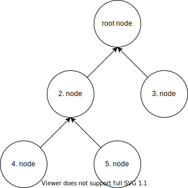
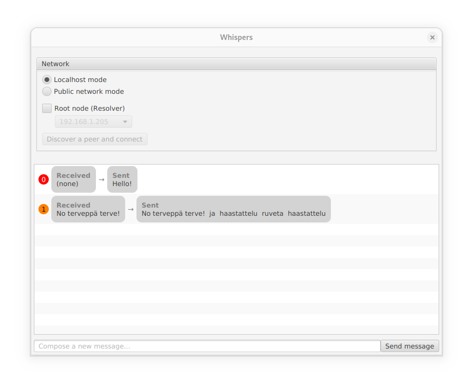
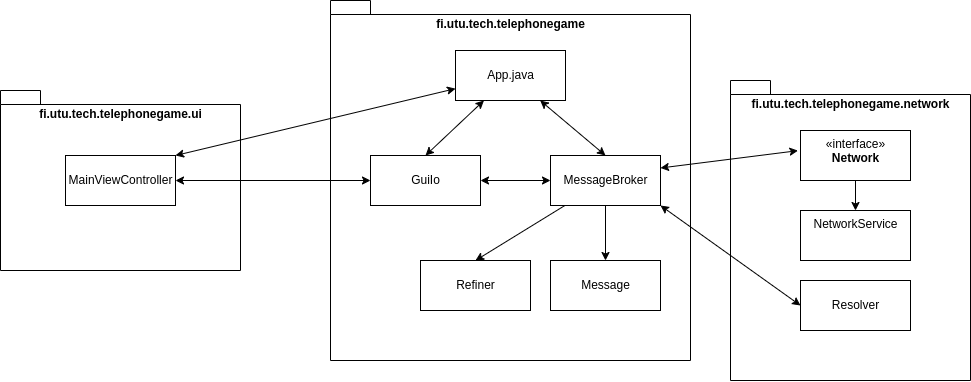

# Whispers ("Broken Telephone")

## Learning goals and project template

In this assignment we will be practicing establishing and managing network connections. Threads play a large role in networking as well as there is a requirement to serve multiple clients concurrently. The assignment will be done using the provided program skeleton: you will need to implement the missing parts of the program.

The game utilizes JavaFX library to provide the graphical user interface. Knowledge on JavaFX is not required to complete the exercise though. The only necessary thing to understand about graphical UI's is that they are essentially a giant loop that will handle user events and draw the window contents depending on the user actions. If you block the UI thread, the graphical UI stops responding.

The project template is a Maven project (https://maven.apache.org/). You do not need to configure the Maven project yourself but using the provided Maven configuration is required: the submission must compile and run using Maven command line interface. If the directory structure is not altered too much, there should be no problems.

## Topic and Description

The topic for the exercise is ["Whispers"](https://en.wikipedia.org/wiki/Chinese_whispers) also known as "broken telephone", "telephone game" or "Chinese whispers" in English. The rules for traditional broken telephone are simple: We need a bunch of people standing in line-like formation. The first person on the line whispers a word or a sentence to the person next to them. This person relays the whisper to the person next to him/her and so on. Due to not hearing the sentence perfectly or just deliberately altering it, the message changes along the way and it may not sound anything like in the beginning when it finally reaches the end of the line.

In this exercise the traditional broken telephone will be upgraded to the "network-age" by using a peer-to-peer networking architecture. Instead of people whispering to each other, we have applications communicating and relaying messages over TCP sockets. As the application works on peer-to-peer principle, it contains both, the client and server components to communicate with other *peers*, there is no separate client and server applications - there are just multiple instances of the same application running and each of them connect to each other.

## Peer network structure and message realying

Unlike a traditional broken telephone, the "phone line" **may** not necessarily be a simple straight "queue", where each peer would have only two *neighbours*: the one from whom the message is received and the one to whom it is sent. By "neighbour", we mean peers who are directly connected to each other, not indirectly through another peer. A peer in this task **may have several neighbours**: the peer itself has probably connected to another peer (unless the peer is the first in the network) and, in addition, several peers may have connected to that peer. The structure of the peer network is determined by the peer to which each peer has chosen to connect. For example, the figure below shows a peer network with eight peers. If we consider peer 7, it has 3 neighbours. Peer 7 has itself connected to peer 1, and peers 6 and 8 have in turn connected to peer 7. The arrows do not represent the direction in which messages are sent, but the direction of connection (whose client component has connected to which server component). Messages can go in either direction in the network.

")

The way messages travel in a peer-to-peer network is that the peer who transmits the message first passes it on to its neighbours, who in turn pass it on to their neighbours, and so on. Finally, once all neighbours have passed the message to all their neighbours, the message is propagated to all peers in the network. Of course, since it is a **broken** phone, each peer has permission to modify the message as they wish before forwarding it. For example, in the previous picture, if peer 7 wanted to put out a new message, it would send the message to peers 1, 6 and 8, and these peers would in turn send the message (after modifying it) to their neighbours.

It is worth noting that the message may mutate in different ways in different directions. The more observant may also notice a problem with the message forwarding described above: if a received message is forwarded to all neighbours, it is also returned to the sender itself. This causes the message to be sent to everyone again. The consequence is that the message may remain circulating on the network forever. Therefore, messages must be accompanied by a unique message ID value, which, when compared to "seen" messages, can be used to prevent the same message from being forwarded again, and thus from "haunting" in the network.

### Establishing connection

In order for program instances to connect to each other, the peer's server component must listen for peers on some port. In turn, the peer's client component must also be able to connect to another peer (excl. the first peer, since there is no others to connect to on the network). To be able to connect to another peer, we need the network address (IP address) and port of one of the peers on the network. This information could theoretically be entered manually for each peer. For example, if a peer with the IP address `192.168.1.10' was waiting for new peers on TCP port 5000, this information could be manually entered for the new peer, allowing the peer to connect to that address and port. The peers would then become neighbours. However, this manual "pairing" of peers is not necessary in our task pool, since a special "Resolver" class is provided to help find and determine the IP addresses and ports of the peers.

The idea of Resolver is quite simple: the first of the program instances started must be configured as the "root node". This will make the program start the server component of Resolver. This selection is made from the user interface by the user. The Resolvers of the other peers should be started in client mode. In client mode, Resolver sends a broadcast message on the network, asking if there is a root node on the same subnet that could send an IP address and port number of a known peer to connect to. When a resolver in "root node" mode receives this message, it responds by giving the peer that sent the peer request message, information about another peer (IP and port), as well as a port number on which it would like the peer, that sent the request, listen to other peers. The Resolver server will also capture the address information of the peer who sent the query, so that it can later share this information with another peer if necessary. The Resolver client component returns the configuration information received from its Resolver server in a special `PeerConfiguration' object. This object contains information about the IP address and port on which the peer should connect, and also a request for the port on which the peer itself should listen to new peers.

The resolver is built in such a way that when peers connect to each other over the network based on the IP addresses it provides, they form a peer-to-peer network structure similar to a binary tree (see figure). As in the previous example, in this binary tree, when a node (ie. peer) decides to send a message, it sends the message to all its neighbours, which in turn modify the message and forward it to their neighbours.

For example, in the binary tree graph above, where peers are represented as nodes, if node 2 decided to send a new message to the other nodes, it would send the message to all its neighbours: node 4, node 5 and the root node (node 1). The root node would modify the message as it desires, and then forward it to node 3. If in turn, node 3 decided to send a **new** message, it would first send it to its only neighbour, the root node, which would send the message (as modified) to node 2, which would make its own changes and send the modified message to nodes 4 and 5. In this way, the message would propagate around the network from node to node, always slightly modified. Note that in the figure, the arrows **still** do not indicate which direction the messages are sent, but rather which node is connected to which node (i.e. the client -> server relationship).

If the program is run **in localhost mode, Resolver chains the peers in a simple queue format** instead of a binary tree.

When completing the exercise, you don't need to care much about the Resolver's implementation -- the template includes the necessary lines of code to get the necessary information from the resolver for connecting other peers.

## Application user interface and usage

The graphical user interface can be divided into three main parts: connection settings, chat message box and the last textbox for composing new messages.

The connection settings are used when connecting to the peer network. More on this later on.

The chat message box will show all the messages that your node has sent or relayed. The brightly colored circle shows how many nodes the message has traversed before reaching to the current node ("hop count"). Value of 0 means that this node composed the message. The color of the circle also changes from warm red into blueish tones the more peers were in between us and the original sender.

The *Received* chat bubble should show the message as it was when it reached our node. On the contrary, the *Sent* bubble should show the message as it was when it left (refined) our node and was sent to neighbouring peers. When composing a new message, we naturally did not receive the message from any other peer, thus the *Received* bubble will show *(none)*.

The node shown in the screen shot has composed and sent a new message by itself (Hello!) and also received, refined and relied another message ("No terveppä terve").

In order to compose a new message to the peer network, it should work by inputting the message to the bottom text box and clicking on the *Send message* button.

### Network options

Before messages can be sent, received or forwarded, the program needs to be connected to another running program (peer), or at least wait for another program to connect to us: playing with Whispers alone gets boring after a while.

Two different modes are defined in the template: *localhost mode* and *public network mode*. These affect which port and address information is distributed by the Resolver and thus the peer-to-peer network structure. If *localhost* is selected, the communication is between different ports on your own computer. This mode is suitable for testing when developing a program on a single machine. In this mode, the resolver always returns the data of the peer that connected to the resolver most recently, forming kind of a peer-to-peer network resembing a "line" or "queue". In *Public network mode*, communication will happen between different IP addresses, each listening on the same port number, and requires the use of several computers on the same network. It only works over a single subnet, and therefore does not work over, for example, the public internet. In *Public network mode*, the Reolver distributes addresses in such a way that the peer network is binary in structure.

Note! broadcast messages may not work on the "eduroam" wifi network. However, localhost mode can be used anywhere. If you want to try a connection between multiple computers, you should use a network other than eduroam.

From the Network options, you can specify an instance of the program as the "root node", in which case:

1. The program starts the Resolver server component, which distributes the IP addresses and ports to which new peers can connect to.
2. The program does not attempt to connect to any other peer: the root node is the first peer connected to the peer network and therefore cannot connect to any other peers
3. The program starts its own server component to wait for peers on the default port hardcoded into the program

If, on the other hand, the program **is not** specified as a root node:

1. The program first sends a peer request (`resolver.resolve()`) and waits for a running root node to respond.
2. The root node responds by sending information about a peer that we can connect to, plus a port number that it wants the us (the new peer) to use when listening for other, future peers.
3. Our peer connects to another peer with the information provided by the root node and starts its server component on the desired port

Resolver functionality is included in the template, so you don't have to implement it yourself. When you test your program, one (and only one) program instance must act as the root node, the remaining program instances will request the necessary information from the resolver on the root node and connect to the resulting address. When creating a root node, you must also select the IP address from which your machine can be reached from the *public network mode* drop-down menu.

### Testing and usage

Multiple instances of the program are launched simultaneously, either on the same machine using *localhost* mode or on multiple machines in *public network* mode. **Only one of the program instances should be set as root node**. The peer network is started by pressing the *Start waiting for others* button. In this case, the (finished) program should start waiting for other peers to connect to it.

After starting the root node, other peers can be connected to the network by pressing the "Discover peer and connect" button. With Resolver, the user does not need to know which peer to connect to: the Resolver provides the IP address and port to which the new peer can connect to. Since it is peer-to-peer application after all, each peer that connects to a peer, must also listen for connection requests from other peers on the port suggested by Resolver.

## Structure of the program

### Packages App.java and fi.utu.tech.telephonegame.ui

App.java is the main class of the program. It contains the main method, as well as the startup of some services. The UI package contains classes related to the operation of the graphical user interface.

These classes should not be modified. There is neither need to call methods of these classes directly. We assume that the participants of this course have no experience in user interface programming and the UI part has been mostly abstracted away.

### GuiIO.java

GuiIo is the link between the JavaFx user interface and other parts of the program. This class should not be changed, but the methods inside can be called to update the program interface when necessary.

### Refiner.java

The Refiner class contains methods for specifying how to modify the text content of received messages before forwarding them. You are free to invent your own "text-modifying functions", as long as they are in good taste.

### Message.java

The objects created from Message class should contain the message contents (the text) to be transmitted, as well as the amount of peers the message has gone through to reach this node (hop count). Each message should also have their own ID. Message class objects are used to transmit the "whispers" over the network, thus the class should implement a specific interface in order to be able to be sent over a network using ObjectStreams!

Hint: The message ID can be used to prevent retransmission: if a message tagged with the same ID is received again, it can be thrown in the trash...

### MessageBroker.java
The purpose of the MessageBroker is to forward messages received by the Network class to the various components of the program, such as the user interface, the Refiner, and messages received from Refiner that have been modified, back to the Network component for re-transmission.

The communication between MessageBroker and the Network component should be possible by using the methods defined in Network interface.

### Package fi.utu.tech.telephonegame.network
This package contains all the functionality you need to connect to the network. Most of the assignment work is done under this package.

### Resolver
The Resolver class can be seen as a "dating service" for nodes, as it handles the matching of new nodes to the network in such a way that the resulting network structure resembles a binary tree (and a line in localhost mode). Although we have already discussed the operation of the resolver before, we will repeat it again. In simple terms, the operation is as follows: when a peer is set as root node, a Resolver server is started from the Resolver class It will listen for peer requests that peers other than the root node can make using the `resolve()` method of the same class. The communication is done with UDP sockets to the broadcast address, so the node searching for the root node does not need to know the exact IP address of the root node. The root node responds to the new peer by providing it with the IP address of a known peer on the network and a port to which the new peer can connect to (while guaranteeing a binary tree structure for the network). The same message also conveys a request for the port on which the new peer should listen to for other peers. The resolver server stores the IP address and the requested port request of the new peer, so that it can provide this information to another node in the future.

For the topics covered in this course, it is useful to be familiar with how the resolver works, but understanding its internal logic is not essential for doing the exercise. What is essential to understand is that in order to establish a TCP connection to a peer, its IP address must be determined. The resolver is created for this purpose. MessageBroker's `connect` method provides the logic for when to use the resolver in server mode and when to use it in client mode. This method can also call the correct methods of NetworkService (described below) with the correct arguments.

No changes should be made to the resolver.

### NetworkService

NetworkService implements the Network interface in the same package. These methods could, for example, start listening for peer connection requests (not Resolver requests, they shouldn't be handled in NetworkService!), connect to another peer, or send messages to peers that are already connected.

Needless to say, writing this class is a big part of the assignment. As an additional tip, the `fi.utu.tech.telephonegame.network` package will probably also need new classes to be written.

## Requirements for completing the assignment
- Implement the network functionality of the application
	- A peer must be able to connect to another peer (client component)
	- The peer must also be able to handle multiple incoming connections (multithreaded server component) 
	- The peer must be able to send and receive Message objects from and to neighbours (i.e. to those who have directly connected to the peer, as well as to the peer to whom the peer has connected to)
		- Received messages should be temporarily stored in some data structure, from which MessageBroker can retrieve them using the `retrieveMessage` method.
		- The `postMessage` method called by MessageBroker must store the messages-to-be-sent in some data structure, from which they will eventually be sent to all neighbours on the network (see NetworkService::run)
	- Use TCP sockets along with `ObjectOutputStream` and `ObjectInputStream` to transmit Message objects
	- Changes are made to the `NetworkService` class, and to any new classes you see fit
- Modify the Message class so that
	- It can be sent over the network using the `ObjectOutputStream` class
	- Also add the necessary attributes to the class in order to be able to send the message contents (as string) and the amount of nodes that the message has been passed so far (hops). In addition, each message must have a UUID-based identifier so that peers can recognize if the message has already been visited by them.
- Implement methods to MessageBroker to get the objects received from the network by your Network component to the MessageBroker side, and process the received Message objects so that
	1. Message is edited in Refiner
	2. The received message and the edited message and hop count are displayed in the UI
	3. The edited message is sent to all neighbours
		- Once a message has been sent, it will not be processed again and will not be forwarded if someone sends it back (ID attribute of the Message object will be probably useful here)
- Implement a message modification method in the Refiner class to mutate the text content of messages (Optional)
	- One example is included, but you may come up with your own replacement
	- Use your imagination! Note that the purpose is to modify the content of a Message object, not to create a new Message object
- The program does not need to be able to recover from a situation where one of its peers drops out
